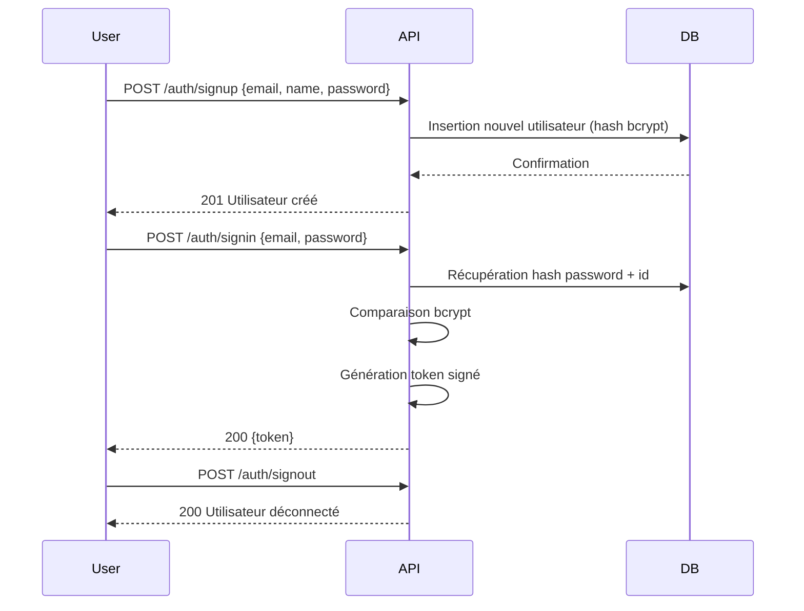

# Authentification Utilisateur
## Contexte
> Le système gère l'inscription, l'authentification et la déconnexion des utilisateurs via un token signé. Les mots de passe sont hashés, les tokens sont signés HMAC SHA-256 en base64url, et l'authentification protège les routes critiques.

## Objectifs
* Permettre la création de compte (signup) avec nom, email, mot de passe et avatar par défaut.
* Assurer la connexion (signin) avec validation du mot de passe via hash.
* Fournir un endpoint pour la déconnexion (signout) invalidant la session côté client.
* Toutes les erreurs sont centralisées via `ResponseException`.
* Protéger les endpoints via un middleware `isAuth` validant le token.

## Fonctionnement du Token
Le token retourné par `/signin` a le format :
```
base64url({email,id,role}).base64url(timestamp).base64url(signature)
```

* La signature est un HMAC SHA-256 signé avec `process.env.SIGNEDTOKENSECRET`
* Le token est considéré valide si :

```ts
Date.now() - parseInt(VALIDTIMETOKEN) < timestamp;
```
> ⚠️ Le token **n'est pas** révoqué côté serveur : il expire automatiquement via timestamp.

## Flux fonctionnel


## Contraintes techniques
| Catégorie      | Détail                                                                    |
| -------------- | ------------------------------------------------------------------------- |
| **Hash**       | `bcryptjs` avec saltRounds = 10                                           |
| **Token**      | Signature HMAC SHA-256 (clé secrète via env), format base64url            |
| **Validation** | Email (`email-validator`), name ≤ 16 caractères, mot de passe obligatoire |
| **Stateless**  | Aucun stockage de session côté serveur                                    |
| **Librairies** | `express`, `bcryptjs`, `email-validator`, `crypto`, `ts-sql-query`        |

## Règles métier
* Le nom ne doit pas dépasser 16 caractères.
* L'email est unique et obligatoire.
* Le mot de passe est obligatoire (pas de validation de complexité avancée dans cette version).
* Le token expire en fonction de `VALIDTIMETOKEN` (par défaut 1h).
* Les erreurs sont toujours retournées au format `{data: <message>}` avec un code HTTP approprié.

## Cas limites et erreurs prévues| Cas                                | Code | Message                            |
| ---------------------------------- | ---- | ---------------------------------- |
| Nom vide ou > 16 caractères        | 400  | `"Nom invalide"`                   |
| Email vide ou invalide             | 400  | `"Email invalide"`                 |
| Mot de passe vide                  | 400  | `"Password invalide"`              |
| Email déjà existant (signup)       | 400  | `"Email déjà existant"`            |
| Nom déjà existant (signup)         | 400  | `"Nom déjà existant"`              |
| Email inexistant (signin)          | 401  | `"Email ou mot de passe invalide"` |
| Mot de passe incorrect (signin)    | 401  | `"Email ou mot de passe invalide"` |
| Token manquant (route protégée)    | 401  | `"Utilisateur non connecté"`       |
| Token non string                   | 418  | `"Token isn't a string"`           |
| Token expiré ou signature invalide | 403  | `"Invalid token"`                  |


## Sécurité
* Pas de refresh token (par design)
* Pas de session serveur
* Token transporté via cookie ou dans le header
* Cookie `token` : `httpOnly`, `secure`, `sameSite=strict`
* Expiration contrôlée côté client via timestamp signé
* Contrôle strict CORS (whitelist dynamique)

## Références
* 🔐 [RFC 7519 - JSON Web Token (adapté)](https://datatracker.ietf.org/doc/html/rfc7519)
* 🔐 [`bcryptjs`](https://www.npmjs.com/package/bcryptjs)
* 🔐 [`email-validator`](https://www.npmjs.com/package/email-validator)
* 🔐 Middleware erreurs : `ResponseException`
* 📁 Modèle DB : `User`
* 📦 Génération de token : `TokenService` (interne)

## À venir (non implémenté dans cette version)
* 🔁 Refresh token
* 🔑 Réinitialisation de mot de passe
* 🛡️ OAuth / SSO