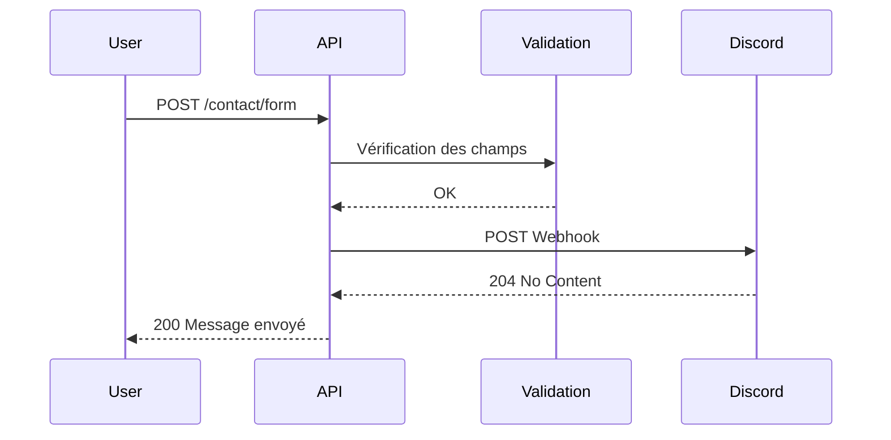

# Contact - Formulaire utilisateur
## Contexte
> Permettre aux utilisateurs de soumettre un message via un formulaire de contact. Ce message est transmis de manière sécurisée à l'équipe via un webhook Discord.

## Objectifs
* Permettre aux utilisateurs de contacter l'équipe sans authentification.
* Valider les champs du formulaire côté serveur.
* Transmettre le contenu au format enrichi via Discord Webhook.
* Garantir la traçabilité et la sécurité des messages entrants.

## Portée (Scope)
* **Inclus** :
  * Endpoint public `POST /contact/form`.
  * Validation de l'email, prénom, nom, message et du consentement.
  * Intégration avec un webhook Discord pour réception des messages.
* **Exclus** :
  * Réponse directe par email ou interface d'administration.
  * Historisation côté base de données.
  * Support multilingue.

## Dépendances
* **Librairies internes** :
  * `catchError`, `handleCoreResponse` pour la gestion d'erreurs et de réponses standardisées.
  * `validateAndNormalizeEmail`, `validateStringField`, `validateBooleanField` pour la validation des données.
* **Librairies tierces** :
  * `axios` pour la requête vers le webhook Discord.
  * `express` pour la gestion des routes.
* **APIs externes** :
  * Webhook Discord via `process.env.DISCORD_WEBHOOK_URL`.

## Flux fonctionnel

## Contraintes techniques
* **Sécurité** :
  * Limitation à 100 requêtes / 5 minutes par IP (rate limiting global).
  * Protection CORS avec whitelist d'origines autorisées.
* **Validation stricte** :
  * Email au format valide et normalisé.
  * Prénom/Nom : max 20 caractères.
  * Message : max 2000 caractères.
  * Consentement (`isChecked`) requis et booléen.
* **Fiabilité** :
  * Gestion centralisée des erreurs (middleware).
  * Webhook Discord appelé de manière asynchrone avec traitement des erreurs silencieux.

## Règles métier
* Tous les champs sont obligatoires.
* Le champ `isChecked` doit être à `true` (consentement explicite).
* Aucune donnée n'est stockée en base (transmission directe).
* L'email est validé et normalisé avant transmission.

## Cas limites et erreurs prévues
| Cas                                 | Comportement attendu                                  |
| ----------------------------------- | ----------------------------------------------------- |
| Email invalide                      | 422 - Format email invalide                           |
| Prénom/Nom trop long                | 400 - Champ trop long                                 |
| Consentement manquant (`isChecked`) | 400 - Consentement requis                             |
| Corps de requête vide ou partiel    | 400 - Paramètre requis manquant                       |
| Webhook Discord indisponible        | 502 - Erreur lors de l'envoi (log interne uniquement) |

## Références
* [endpoints.md](./endpoints.md)
* [data-model.md](./data-model.md)
* Documentation Discord Webhook : [Discord Docs](https://discord.com/developers/docs/resources/webhook)