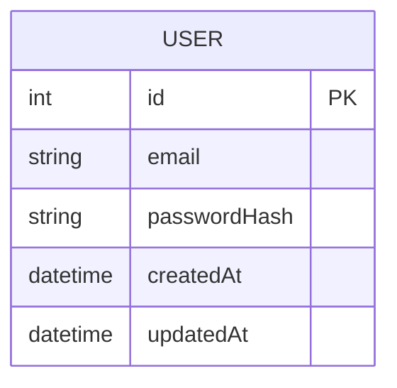

# Modèle de données - [Nom de la fonctionnalité]
## Vue d'ensemble
> Brève description du rôle du modèle dans la fonctionnalité.
- **Exemple** : Le modèle `User` stocke les informations nécessaires à l'authentification et à la gestion de profil.
## Schéma du modèle
### Diagramme
> Diagramme UML, ERD ou lien vers un fichier `.drawio` ou `.svg`.

### Définition technique
> Exemple en JSON Schema / Prisma / ORM.
```json
{
  "type": "object",
  "properties": {
    "id": { "type": "integer" },
    "email": { "type": "string", "format": "email" },
    "passwordHash": { "type": "string" },
    "createdAt": { "type": "string", "format": "date-time" },
    "updatedAt": { "type": "string", "format": "date-time" }
  },
  "required": ["email", "passwordHash", "createdAt"]
}
```
## Contraintes de validation
| Champ        | Type     | Contraintes                                 |
| ------------ | -------- | ------------------------------------------- |
| email        | string   | format email, unique                        |
| passwordHash | string   | hashé avec bcrypt, longueur fixe selon algo |
| createdAt    | datetime | auto-généré à la création                   |
| updatedAt    | datetime | mis à jour automatiquement                  |
## Relations avec d'autres modèles
| Relation | Modèle lié  | Type de relation                                 | Clé étrangère |
| -------- | ----------- | ------------------------------------------------ | ------------- |
| 1-N      | Transaction | Un utilisateur peut avoir plusieurs transactions | `userId`      |
## Index & performances
* Index sur `email` (unique)
* Index sur `createdAt` pour filtrer rapidement par date
## Notes & références
* Lien vers [specification.md](./specification.md)
* Lien vers [endpoints.md](./endpoints.md)
* Documentation externe : [bcrypt](https://www.npmjs.com/package/bcrypt)