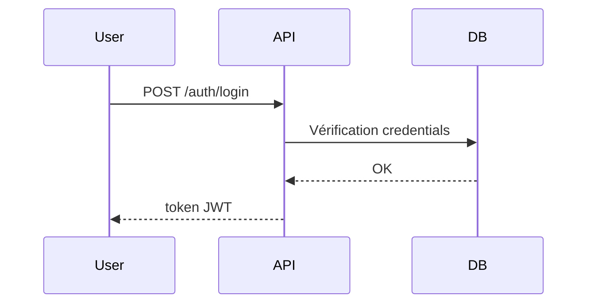

# [Nom de la fonctionnalité]
## Contexte
> Brève description du problème métier ou du besoin couvert.
- **Exemple** : Les utilisateurs doivent pouvoir créer un compte et s'authentifier pour accéder aux zones sécurisées de l'application.
## Objectifs
- Liste claire des objectifs principaux de la fonctionnalité.
- **Exemple** :
  - Permettre l'authentification via email + mot de passe.
  - Fournir un token JWT pour les appels ultérieurs.
  - Protéger les endpoints sensibles.
## Portée (Scope)
- **Inclus** :
  - Ce que la feature doit couvrir.
- **Exclus** :
  - Ce qui n'est pas couvert dans cette version.
## Dépendances
- Services internes utilisés
- Librairies tierces
- APIs externes
- **Exemple** : 
  - `bcrypt` pour le hash mot de passe
  - `jsonwebtoken` pour la génération du token
## Flux fonctionnel
> Diagramme ou description des étapes (UML, Mermaid, ou lien vers un fichier `.drawio`).

## Contraintes techniques
* Performance attendue
* Sécurité (normes, encryption, etc.)
* Compatibilité (versions supportées)
## Règles métier
* Liste claire des règles spécifiques à cette fonctionnalité.
* **Exemple** :
  * Le mot de passe doit contenir au moins 8 caractères, une majuscule et un chiffre.
  * Le token expire après 15 minutes.
## Cas limites et erreurs prévues
| Cas                    | Comportement attendu    |
| ---------------------- | ----------------------- |
| Email inexistant       | Retour 401 Unauthorized |
| Mot de passe incorrect | Retour 401 Unauthorized |
| Tentatives > 5         | Blocage 15 min          |
## Références
* Lien vers `endpoints.md`
* Lien vers `data-model.md`
* Documentation externe (RFC, API tiers, etc.)