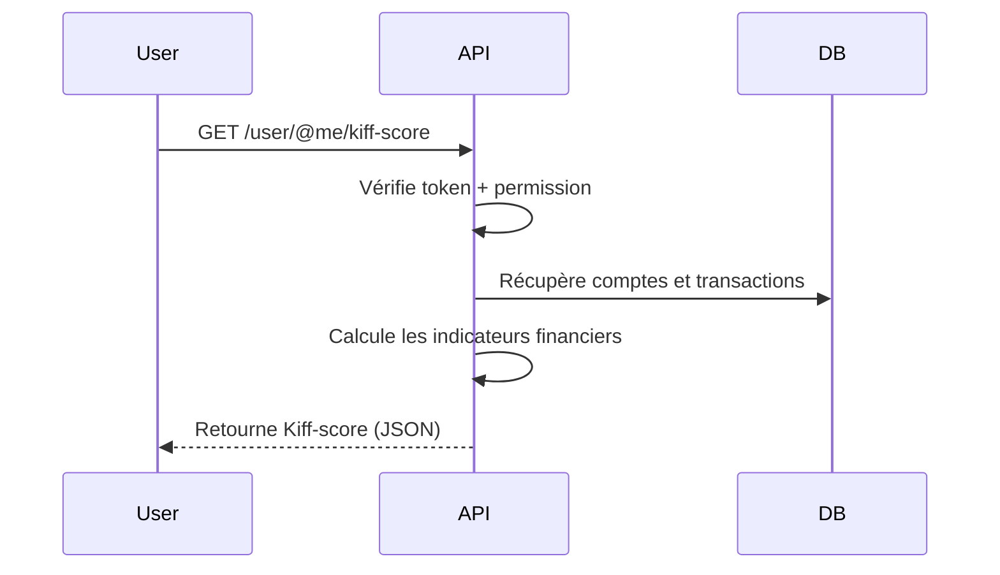

# Kiff Score (`/user/@me/kiff-score`)
## Contexte
> Les utilisateurs souhaitent savoir **combien ils peuvent dépenser chaque jour** sans mettre en péril leur stabilité financière.
> Le **Kiff-score** est une métrique de bien-être financier, calculée à partir de leurs comptes et transactions, combinant vision **court terme** (mois en cours) et **moyen terme** (année).

## Objectifs
* Fournir à l'utilisateur une **estimation journalière personnalisée** (en €) de sa capacité de dépense "confortable".
* Intégrer les notions de :
  * **revenus et dépenses réelles**,
  * **réserve disponible**,
  * **taille du foyer**,
  * **projets financiers et objectifs d’épargne**,
  * **stabilité de situation** et **mood visuel**.

## Portée (Scope)
### Inclus
* **`GET /user/@me/kiff-score`** : calcule et retourne le kiff-score de l'utilisateur connecté.
* Agrégation de données :
  * Comptes bancaires et soldes.
  * Transactions (jusqu’à 10 000).
* Calculs :
  * Kiff mensuel et annuel.
  * Ajustement avec réserve liquide.
  * Score de stabilité (`stabilité`) et mood (`mood`).
* Authentification obligatoire (token).
* Contrôle d'accès via permission `UserViewOwn`.

### Exclus
* Historique des scores (non stocké en base).
* Comparaison entre utilisateurs.
* Recommandations automatiques.
* Visualisation graphique (à faire côté client).
* Calcul pré-calculé / async (prévu pour future version).

## Endpoints
| Méthode | URL                    | Description                              | Permissions requises |
| ------- | ---------------------- | ---------------------------------------- | -------------------- |
| GET     | `/user/@me/kiff-score` | Calcule le Kiff-score du profil connecté | `UserViewOwn`        |

## Flux fonctionnel


## Contraintes techniques
### Sécurité
* Authentification via token signé (middleware `isAuth`).
* Permissions vérifiées avec `checkPermission(UserViewOwn)`.
* Pas de données sensibles dans la réponse.
* Limitation explicite des transactions analysées (par défaut 10 000 max).

### Validation
* L’utilisateur doit avoir au moins 2 mois d’historique pour un score fiable.
* Si peu de données : fallback "low-data" plus prudent.

### Performance
* Chargement en **parallèle** des comptes et transactions (`Promise.all`).
* Calcul à la volée, non stocké.
* Durée visée < 200 ms.

## Cas limites et erreurs prévues
| Cas                                 | Réponse attendue              |
| ----------------------------------- | ----------------------------- |
| Non authentifié                     | `401 Unauthorized`            |
| Permission insuffisante             | `403 Forbidden`               |
| Aucune donnée de compte/transaction | `200 OK` avec mode `low-data` |
| Erreur inattendue dans un calcul    | `500 Internal Error`          |

## Services utilisés
* `fetchUserAccounts(userId)` → liste des comptes bancaires.
* `fetchUserTransactions(userId)` → liste des transactions.
* `splitTransactions` → séparation crédits / débits.
* `calculateReserve` → somme des soldes liquides.
* `computeMonthlyMetrics(...)` → logique budgétaire mensuelle.
* `computeAnnualMetrics(...)` → logique budgétaire annuelle.
* `calculateCushion(...)` → coussin de sécurité (€/jour).
* `calculateStabilityScore(...)` → score de stabilité + `mood`.
* `calculateSurvivalMonths(...)` → réserve / dépenses mensuelles.
* `calculateBVM(...)` → base de vie minimum.
* `handleCoreResponse(...)` → formate proprement la réponse ou l’erreur.

## Règles métier
* Le **Kiff-score est propre à l’utilisateur connecté**.
* **Jamais de données croisées** entre utilisateurs.
* L’estimation est plus prudente si :
  * peu de transactions récentes,
  * anomalies détectées (`outlier`),
  * réserve proche de zéro.

## Exemple de réponse
```json
{
  "mode": "normal",
  "nb_personne_foyer": 1,
  "BVM": 300,
  "budget_mensuel_restant": 435.12,
  "kiff_brut_mensuel": 14.5,
  "budget_annuel": 8253.32,
  "kiff_brut_annuel": 22.6,
  "kiff_brut": 14.5,
  "reserve_liquide": 1600.5,
  "coussin": 2.3,
  "kiff_ajuste": 16.8,
  "mois_survie": 3.1,
  "score_stabilite": 81,
  "mood": "relax",
  "details": {
    "charge_annuelle": 10457.33,
    "projet_pondere": 2300,
    "revenu_annuel": 21000,
    "moyenne_depenses_journalier": 22.5
  }
}
```

## Glossaire des variables principales
| Champ                    | Unité   | Description                                    |
| ------------------------ | ------- | ---------------------------------------------- |
| `BVM`                    | €/mois  | Base de vie minimum pour le foyer              |
| `budget_mensuel_restant` | €       | Ce qu’il reste pour finir le mois (estimation) |
| `kiff_brut_mensuel`      | €/jour  | Kiff basé sur le mois courant                  |
| `budget_annuel`          | €       | Budget disponible annuel                       |
| `kiff_brut_annuel`       | €/jour  | Kiff basé sur l’année                          |
| `kiff_ajuste`            | €/jour  | Kiff final avec coussin                        |
| `reserve_liquide`        | €       | Liquidités disponibles (comptes bancaires)     |
| `mois_survie`            | mois    | Combien de mois peut tenir la réserve          |
| `score_stabilite`        | 0 à 100 | Score de robustesse financière                 |
| `mood`                   | Enum    | `"relax"`, `"serré"`, `"alerte"`               |

## Sécurité & Bonnes pratiques
| Risque                         | Solution                                            |
| ------------------------------ | --------------------------------------------------- |
| Utilisateur non connecté       | Vérification via token (middleware `isAuth`)        |
| Accès à un autre profil        | Restriction stricte via `req.user.id`               |
| Traitement de données absentes | Fallback `low-data` sécurisé                        |
| Mauvais calcul (edge-case)     | Fallbacks, valeurs plancher, et `try/catch` partout |
| Injection / surcharge          | Aucun champ d'entrée côté utilisateur (GET sec)     |