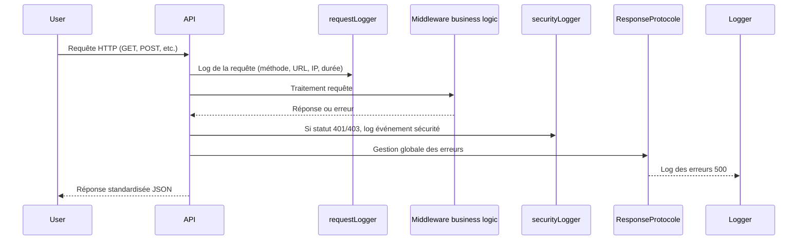

# Log
## Contexte
> Cette fonctionnalité couvre la gestion centralisée et sécurisée des logs applicatifs pour le suivi, la traçabilité, la sécurité et le diagnostic des erreurs.

* **Exemple** : Logger les requêtes HTTP, les erreurs serveur, ainsi que les événements sensibles de sécurité (accès refusés, tentatives de login échouées, etc.).

## Objectifs
* Centraliser la gestion des logs via `winston` avec rotation quotidienne.
* Logger toutes les requêtes HTTP entrantes avec leurs métadonnées.
* Capturer et logger globalement les erreurs (notamment 500).
* Logger spécifiquement les événements sensibles liés à la sécurité (403, 401, rate limit).
* Protéger l'application contre les abus via un rate limiting efficace.
* Gérer les CORS et la sécurité HTTP via des middlewares standards.

## Portée (Scope)
* **Inclus** :
  * Middleware de logging des requêtes (`requestLogger`).
  * Middleware global de gestion d'erreurs et de format standard (`ResponseProtocole`).
  * Middleware de logging des événements de sécurité (`securityLogger`).
  * Configuration de Winston avec rotation de fichiers journaliers pour erreurs et logs combinés.
  * Rate limiting global pour limiter les abus (100 requêtes / 5 minutes / IP).
  * Sécurisation des entêtes HTTP via `helmet`.
  * Configuration CORS whitelistée.
  * Upload de fichiers sécurisé et limité à 50Mo.

* **Exclus** :
  * Fonctionnalités spécifiques aux routes métiers (authentification, transactions, etc.).
  * Monitoring avancé ou alerting (out of scope).

## Dépendances
* **Librairies** :
  * `winston` + `winston-daily-rotate-file` (gestion avancée des logs).
  * `express` (framework HTTP).
  * `helmet` (sécurité HTTP).
  * `cors` (gestion des CORS).
  * `express-rate-limit` (limitation du nombre de requêtes).
  * `express-fileupload` (gestion upload fichiers).
  * `cookie-parser` (gestion des cookies).

## Flux fonctionnel


## Contraintes techniques
* **Performance** : Le logger doit être non bloquant, éviter d'impacter la latence.
* **Sécurité** :
  * Utilisation de `helmet` pour sécuriser les entêtes HTTP.
  * CORS strictement whitelisté, avec support regex.
  * Limitation stricte des tailles de fichiers uploadés (max 50 Mo).
  * Rate limit pour éviter attaques DDoS ou abus API.
* **Compatibilité** :
  * Support Node.js LTS récent.
  * Compatible avec environnements `development` et `production`.

## Règles métier
* Toutes les requêtes HTTP doivent être loggées avec : méthode, URL, code HTTP, temps d'exécution, IP.
* Les erreurs serveur (status ≥ 500) sont loggées avec message et stack trace.
* Les accès refusés (403) et les accès non autorisés (401) génèrent un log spécifique.
* Le système de rate limiting bloque après 100 requêtes en 5 minutes par IP, avec message d'erreur standardisé.
* Les fichiers uploadés doivent respecter la limite de taille, sinon réponse 413.

## Cas limites et erreurs prévues
| Cas                            | Comportement attendu                                     |
| ------------------------------ | -------------------------------------------------------- |
| Origine CORS non whitelistée   | Rejet avec 403 Forbidden + message d'erreur spécifique   |
| Trop de requêtes (>100/5min)   | Rejet avec 429 Too Many Requests et message standardisé  |
| Fichier upload trop volumineux | Rejet avec 413 Payload Too Large, message JSON structuré |
| Erreur serveur non gérée       | Réponse JSON standardisée, log détaillé côté serveur     |

## Références
* Lien vers `endpoints.md` (routes API)
* Lien vers `data-model.md` (modèles de données)
* Documentation externe :
  * [Helmet](https://helmetjs.github.io/)
  * [Express Rate Limit](https://github.com/nfriedly/express-rate-limit)
  * [Winston Logger](https://github.com/winstonjs/winston)
  * [CORS](https://developer.mozilla.org/fr/docs/Web/HTTP/CORS)

### Annexes - Extraits de code essentiels
#### Configuration Winston (services/logs.ts)

```ts
import winston from "winston";
import path from "path";
import 'winston-daily-rotate-file';

const logDir = path.join(__dirname, "../../logs");

export const logger = winston.createLogger({
  level: process.env.NODE_ENV === "production" ? "info" : "debug",
  format: winston.format.combine(
    winston.format.timestamp(),
    winston.format.json(),
  ),
  transports: [
    new winston.transports.Console({
      level: 'info',
      format: winston.format.printf(info => `[${info.level.toUpperCase()}] ${info.message}`)
    }),
    new winston.transports.DailyRotateFile({
      filename: path.join(logDir, "error-%DATE%.log"),
      level: "error",
      maxFiles: 14,
    }),
    new winston.transports.DailyRotateFile({
      filename: path.join(logDir, "combined-%DATE%.log"),
      maxFiles: 14,
    }),
  ],
  exceptionHandlers: [
    new winston.transports.DailyRotateFile({
      filename: path.join(logDir, "exceptions-%DATE%.log"),
      maxFiles: 14,
    })
  ]
});
```

#### Middleware requestLogger (middleware/requestLogger.ts)
```ts
export const requestLogger = (req, res, next) => {
  const end = httpRequestDurationMicroseconds.startTimer();
  const start = Date.now();

  res.on("finish", () => {
    const duration = Date.now() - start;
    end({ method: req.method, route: req.route?.path || req.originalUrl, status_code: res.statusCode });

    logger.http("HTTP Request", {
      method: req.method,
      url: req.originalUrl,
      status: res.statusCode,
      durationMs: duration,
      ip: req.ip
    });
  });

  next();
};
```

#### Middleware securityLogger (middleware/securityLogger.ts)
```ts
export const securityLogger = (req, res, next) => {
  res.on("finish", () => {
    if (res.statusCode === 403) {
      logger.warn("Access Denied", {
        method: req.method,
        url: req.originalUrl,
        ip: req.ip,
        user: req.user?.id || null
      });
    }
    if (res.statusCode === 401) {
      logger.warn("Unauthorized access attempt", {
        method: req.method,
        url: req.originalUrl,
        ip: req.ip
      });
    }
  });
  next();
};
```

#### Middleware global de gestion d'erreur (middleware/responseProtocole.ts)
```ts
export const ResponseProtocole = (err, req, res, next) => {
  if (!("status" in err)) {
    err = ResponseException().UnknownError();
  }

  if (err.status >= 500) {
    logger.error("Server Error", {
      message: err.message,
      stack: err.stack,
      url: req.originalUrl,
      method: req.method,
      ip: req.ip
    });
  }

  return res.status(err.status).json(err);
};
```