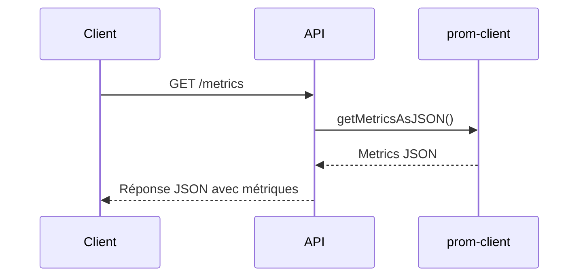

# Metrics
## Contexte
> Les métriques Prometheus sont nécessaires pour monitorer la performance et la santé de l'API, notamment les temps de réponse HTTP.

## Objectifs
* Exposer des métriques Prometheus accessibles via un endpoint dédié.
* Mesurer la durée des requêtes HTTP selon la méthode, la route et le code de statut.
* Permettre une surveillance fine pour détecter les anomalies de performance.

## Portée (Scope)
* **Inclus** :
  * Middleware de collecte des métriques HTTP.
  * Endpoint `/metrics` exposant les métriques au format JSON.
* **Exclus** :
  * Intégration avec un serveur Prometheus (hors scope).
  * Alerting ou dashboard (hors scope).

## Dépendances
* `prom-client` : bibliothèque pour créer et exposer des métriques Prometheus.
* Middleware Express (`catchSync`) pour gestion asynchrone des erreurs.

## Flux fonctionnel


## Contraintes techniques
* Collecte en temps réel avec un histogramme à buckets précis (50ms à 5s).
* Endpoint sécurisé via CORS configuré dans l'app principale.
* Doit gérer un grand nombre de requêtes sans surcharge.

## Règles métier
* Le nom de la métrique exposée est `http_request_duration_ms`.
* Les labels sont : méthode HTTP, route, code HTTP.
* Les buckets définissent les intervalles de latence en millisecondes.

## Cas limites et erreurs prévues
| Cas                                       | Comportement attendu                          |
| ----------------------------------------- | --------------------------------------------- |
| Erreur lors de la collecte                | Retour 500 avec message d'erreur formaté JSON |
| Endpoint appelé par origine non autorisée | Erreur CORS bloquée par middleware principal  |

## Références
* [Endpoints de l'API](endpoints.md)
* [Modèle de données](data-model.md)
* Documentation Prometheus : [https://prometheus.io/docs/instrumenting/clientlibs/](https://prometheus.io/docs/instrumenting/clientlibs/)

## Implémentation
### Configuration des métriques (config/metrics.ts)
```typescript
import client from "prom-client";

export const httpRequestDurationMicroseconds = new client.Histogram({
  name: "http_request_duration_ms",
  help: "Durée des requêtes HTTP en ms",
  labelNames: ["method", "route", "status_code"],
  buckets: [50, 100, 200, 300, 400, 500, 1000, 2000, 5000],
});
```

### Route d'exposition des métriques (routers/metrics.routes.ts)
```typescript
import { ResponseException } from '../middleware/responseException';
import { catchSync } from '../middleware/catchError';
import express, { Request, Response } from 'express';
import client from "prom-client";

export default express.Router().get("/", catchSync(async (req: Request, res: Response) => {
  const metrics = await client.register.getMetricsAsJSON();
  const response = ResponseException(JSON.stringify(metrics)).Success();
  res.status(response.status).json(response);
}));
```

### Intégration dans l'application principale (app.ts)
```typescript
import metricsRoute from "./routers/metrics.routes";

// ...

/** ===================== Metrics ===================== */
app.use("/metrics", metricsRoute);
```