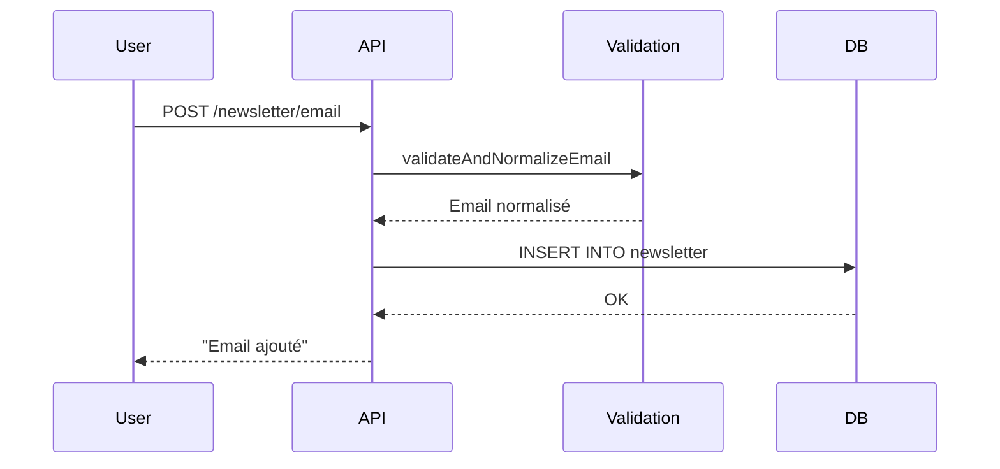

# Newsletter
## Contexte
> Permet aux utilisateurs de s'abonner à une newsletter et permet aux administrateurs d'obtenir la volumétrie de la base emails.

* Objectif métier : collecter les emails d'utilisateurs intéressés pour les recontacter via des campagnes.
* La volumétrie est utile pour le monitoring ou des actions marketing planifiées.

## Objectifs
* Permettre à un utilisateur de soumettre une adresse email valide pour s'inscrire à la newsletter.
* Empêcher les doublons.
* Offrir un endpoint pour consulter le nombre total d'adresses inscrites.

## Portée (Scope)
### Inclus
* Validation et normalisation d'un email
* Insertion sécurisée dans la base
* Prévention des doublons
* Récupération du nombre d'emails stockés

### Exclus
* Désinscription (opt-out)
* Gestion RGPD avancée
* Envoi de mails via le backend
* Interface utilisateur

## Dépendances
* **Interne**
  * `handleCoreResponse`, `catchSync` : gestion standardisée des réponses/erreurs
  * `validateAndNormalizeEmail` : validation email
  * `Newsletter` (modèle DB)
* **Base de données**
  * Table `newsletter(id, email)`
* **Librairies tierces**
  * `ts-sql-query` : mapping et exécution SQL
  * `express` : serveur API

## Flux fonctionnel

## Contraintes techniques
* **Sécurité**
  * Validation et sanitation des inputs côté backend
  * Tentative d'insertion en doublon interceptée
* **Performance**
  * Accès en lecture simple pour la taille DB (pas de pagination ici)
* **Scalabilité**
  * Prévu pour plusieurs centaines de milliers d'emails (optimisation possible côté DB si volumétrie très élevée)

## Règles métier
* L'email doit être valide et normalisé (`toLowerCase`, trim, etc.)
* Un email déjà existant retourne une erreur
* Aucune authentification requise
* Aucun champ autre que l'email accepté (pour l'inscription)

## Cas limites et erreurs prévues
| Cas                         | Comportement attendu                |
| --------------------------- | ----------------------------------- |
| Email invalide              | 422 Unprocessable Entity            |
| Email déjà existant         | 401 Unauthorized (doublon contrôlé) |
| Email manquant dans le body | 400 Bad Request                     |
| Requête vide                | 400 Bad Request                     |
| Base vide (sur `/size`)     | `{ data: 0 }`                       |

## Références
* 📄 [endpoints.md](./endpoints.md)
* 📄 [data-model.md](./data-model.md)
* 🧪 Collection Postman : \[à compléter]
* 📘 OpenAPI : \[à compléter]