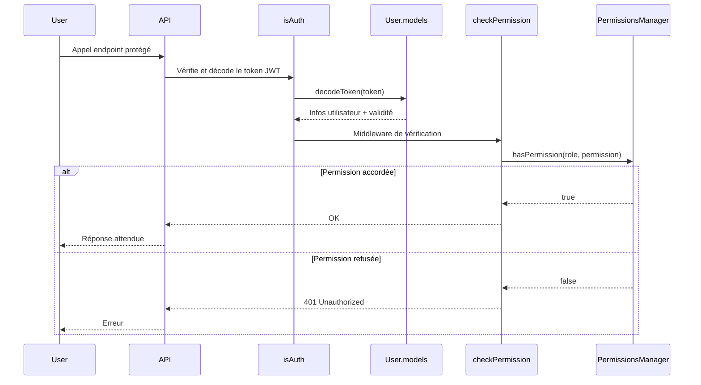

# Gestion des Permissions et Rôles Utilisateurs
## Contexte
> Ce système contrôle l'accès aux fonctionnalités et données sensibles de l'application en fonction du rôle utilisateur et des permissions associées. Il garantit une séparation claire des responsabilités et empêche tout accès non autorisé.

## Objectifs
* Centraliser la définition des rôles et permissions dans un composant unique.
* Offrir un contrôle d'accès performant (vérification en O(1)).
* Gérer la granularité des droits avec les scopes `own` vs `any`.
* Simplifier l'extension via un mapping statique facilement modifiable.
* Sécuriser l'accès aux endpoints via des middlewares.

## Portée (Scope)
* **Inclus** :
* Typage et définition des rôles (`RoleType`) et permissions (`PermissionType`) dans `@types.roles`.
  * Gestion des permissions par rôle via `PermissionsManager`.
  * Vérification des permissions utilisateur (`checkPermission`).
* **Exclus** :
  * Gestion de session persistante côté client.
  * Interface d'administration pour modifier dynamiquement les rôles.
  * Stockage externe des permissions (tout est en mémoire).

## Dépendances
| Type           | Composant                             |
| -------------- | ------------------------------------- |
| Interne        | `config/roles` (`PermissionsManager`) |
| Middleware     | `checkPermission`, `isAuth`           |
| Types partagés | `@types.roles`                        |

## Flux fonctionnel

## Contraintes techniques
* **Performance** : Vérification des droits en O(1) grâce à `Set<PermissionType>`.
* **Sécurité** :
  * Distinction explicite entre `own` (données de l'utilisateur) et `any` (modération ou administration).
* **Extensibilité** :
  * Ajout simple de rôles ou permissions en étendant le mapping dans le constructeur de `PermissionsManager`.
* **Typage strict** :
  * Aucune chaîne libre : tout est basé sur les enums/constantes typées.

## Règles métier
| Rôle              | Description                                                 |
| ----------------- | ----------------------------------------------------------- |
| `ADMIN`           | Accès complet à toutes les ressources et actions.           |
| `STAFF_MODERATOR` | Accès étendu pour modération, mais pas de création globale. |
| `USER`            | Accès limité à ses propres données.                         |

⚠️ Chaque permission est explicitement définie dans le mapping. Aucune déduction implicite n'est faite.

## Cas limites et erreurs prévues
| Cas                                  | Comportement attendu                             |
| ------------------------------------ | ------------------------------------------------ |
| Aucun token fourni                   | 401 Unauthorized (`"No token provided"`)         |
| Token non-string                     | 418 I'm a teapot (erreur humoristique)           |
| Token invalide (structure/signature) | 403 Forbidden                                    |
| Rôle absent dans la requête          | 401 Unauthorized (`"Role manquant"`)             |
| Permission insuffisante              | 401 Unauthorized (`"Permissions insuffisantes"`) |

## Architecture du code
### `PermissionsManager`
Classe centrale définissant :
* Un mapping `Record<RoleType, Set<PermissionType>>`
* `hasPermission(role, permission)` → renvoie un booléen
* `getPermissions(role)` → renvoie la liste des permissions associées

✅ Mapping statique, lisible, facilement maintenable
✅ Pas de duplication des permissions
✅ Vérification rapide (utilisation de `Set.has()`)

### `checkPermission(permission)`
Middleware Express qui :
* Récupère le rôle via `getUserRoleOrThrow(req)`
* Utilise `PermissionsManager.hasPermission()` pour vérifier l'autorisation
* Renvoie une erreur 403 si la permission est refusée

🧱 Utilise `catchSync()` pour la gestion d'erreurs synchrone.

## Références
* [`endpoints.md`](./endpoints.md)
* [`data-model.md`](./data-model.md)
* [RFC 7519 - JWT](https://datatracker.ietf.org/doc/html/rfc7519)