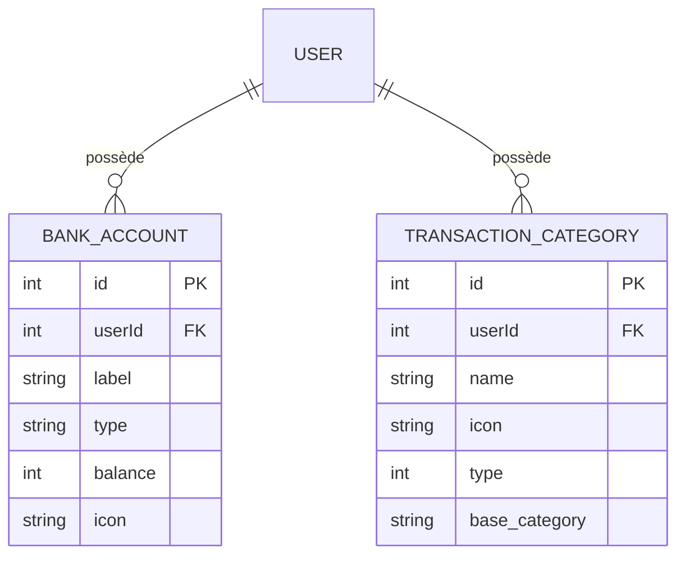

# Modèle de données - Setting
## Vue d'ensemble
> La page de configuration permet à un utilisateur de gérer :
>
> * ses comptes bancaires (`BankAccount`)
> * ses catégories de transactions (`TransactionCategory`)
>
> Ces entités facilitent l'organisation des finances personnelles et permettent un suivi précis des dépenses et revenus.

## Schéma du modèle
### Diagramme global


### Définition technique
#### BankAccount
```json
{
  "type": "object",
  "properties": {
    "id": { "type": "integer" },
    "userId": { "type": "integer" },
    "label": { "type": "string" },
    "type": { "type": "string", "enum": ["checking", "savings", "credit"] },
    "balance": { "type": "number" },
    "icon": { "type": "string" }
  },
  "required": ["userId", "label", "type", "balance"]
}
```

#### TransactionCategory
```json
{
  "type": "object",
  "properties": {
    "id": { "type": "integer" },
    "userId": { "type": "integer" },
    "name": { "type": "string" },
    "icon": { "type": "string" },
    "type": { "type": "integer", "enum": [1, 2] },
    "base_category": { "type": "string" }
  },
  "required": ["userId", "name", "icon", "type"]
}
```

> ⚠️ `type`:
>
> * `1` : Dépense
> * `2` : Revenu

## Contraintes de validation
| Modèle              | Champ   | Type   | Contraintes                                      |
| ------------------- | ------- | ------ | ------------------------------------------------ |
| BankAccount         | userId  | int    | Doit correspondre à un utilisateur existant      |
|                     | label   | string | Non vide                                         |
|                     | type    | string | `"checking"`, `"savings"`, `"credit"` (see [^1]) |
|                     | balance | double | ≥ 0                                              |
|                     | icon    | string | nom d'icône valide (see [^2])                    |
| TransactionCategory | userId  | int    | Doit correspondre à un utilisateur existant      |
|                     | name    | string | Non vide                                         |
|                     | icon    | string | nom d'icône  valide  (see [^3])                  |
|                     | type           | int    | 1 ou 2 (`1` = dépense, `2` = revenu)                        |
|                     | base\_category | string | Chaîne facultative pour regrouper plusieurs sous-catégories |

## Relations avec d'autres modèles

| Source                | Cible         | Type de relation | Clé étrangère   |
| --------------------- | ------------- | ---------------- | --------------- |
| `BankAccount`         | `User`        | Plusieurs → Un   | `userId`        |
| `BankAccount`         | `Transaction` | Un → Plusieurs   | `bankAccountId` |
| `TransactionCategory` | `User`        | Plusieurs → Un   | `userId`        |
| `TransactionCategory` | `Transaction` | Un → Plusieurs   | `categoryId`    |


## Index & performances
* **Index sur `userId`** pour `BankAccount` et `TransactionCategory`
* **Optimisation** des lectures avec sélection ciblée des colonnes
* Le solde est automatiquement converti en euros côté application (`/100`)

## Notes & références
* Lien vers [specification.md](./specification.md)
* Lien vers [endpoints.md](./endpoints.md)
[^1]: [Liste des types valides pour les banques](../../../src/types/@types.bankAccount.ts)
[^2]: [Liste des icons valides pour les banques](../../../src/types/@types.bankAccount.ts)
[^3]: [Liste des icons valides pour les catégories](../../../src/types/@types.transactionCategoryIcons.ts)