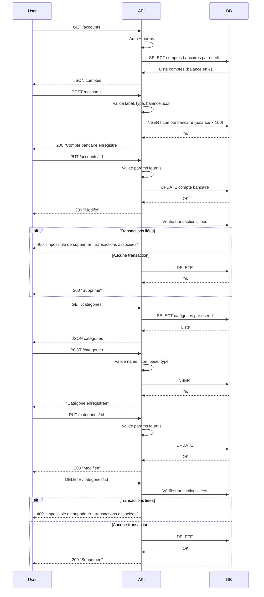

# Gestion des paramètres financiers (`/settings`)
## Contexte
> Les utilisateurs doivent pouvoir gérer leurs comptes bancaires et leurs catégories de transactions personnalisées, afin de mieux organiser leurs finances et planifier leurs dépenses.

## Objectifs
* Permettre à un utilisateur authentifié de gérer ses **comptes bancaires** et **catégories de transactions**.
* Autoriser les opérations CRUD sur ces entités.
* Assurer que chaque ressource est strictement liée à son utilisateur.
* Refuser la suppression d'une ressource si elle est référencée par des transactions.

## Portée (Scope)
**Inclus :**
* **Comptes bancaires** :
  * `GET /accounts` - liste des comptes
  * `POST /accounts` - création
  * `PUT /accounts/:id` - mise à jour
  * `DELETE /accounts/:id` - suppression
* **Catégories de transactions** :
  * `GET /categories` - liste des catégories
  * `POST /categories` - création
  * `PUT /categories/:id` - mise à jour
  * `DELETE /categories/:id` - suppression
* Authentification JWT et vérification fine des permissions par rôle

**Exclus :**
* Transactions (gérées dans un module séparé)
* Synchronisation bancaire externe
* Budgétisation ou rapports

## Dépendances
**Services principaux (`services/settings.core.ts`) :**
* Banques : `getBankAccounts`, `createBankAccount`, `updateBankAccount`, `deleteBankAccount`
* Catégories : `getTransactionCategories`, `createTransactionCategory`, `updateTransactionCategory`, `deleteTransactionCategory`
**Middlewares :**
* `isAuth` - vérifie le token utilisateur
* `checkPermission` - contrôle d'accès aux routes selon les rôles

## Modèle de données
### Compte bancaire
```ts
{
  id: number;
  label: string;
  type: string;
  balance: number; // en euros (converti depuis centimes)
  icon: string;
}
```

### Catégorie de transaction
```ts
{
  id: number;
  name: string;
  icon: string;
  type: 1 | 2; // 1: Dépense, 2: Revenu
  base_category?: string;
}
```

## Flux fonctionnel


## Contraintes techniques
### Sécurité
* Authentification via JWT signé en HMAC-SHA256
* Vérification des permissions explicites :
  * `BankAccountViewOwn`, `BankAccountCreateOwn`, etc.
  * `TransactionCategoryViewOwn`, `TransactionCategoryDeleteOwn`, etc.
### Validation des entrées
* **Comptes :**
  * `label` < 16 caractères
  * `type` ∈ `ALLOWED_BANK_ACCOUNT_TYPES`
  * `balance` numérique (transformé en centimes)
  * `icon` doit être présent dans `FINANCIAL_PLATFORMS`
* **Catégories :**
  * `name` < 16 caractères
  * `icon` ∈ `VALID_CATEGORY_ICONS`
  * `type`: `1 | 2`
  * `base_category` optionnelle
### Performance
* Temps de réponse < 150ms pour opérations CRUD
### Compatibilité
* API REST JSON, consommable par clients web/mobile

## Règles métier
* Chaque ressource appartient à un seul utilisateur
* Aucune modification/suppression possible sans validation de propriété
* **Suppression protégée** :
  * Un **compte bancaire** ou une **catégorie** liée à une transaction ne peut pas être supprimé
* Conversion **automatique** des montants en base 100 (centimes en BDD)

## Cas limites et erreurs prévues
| Cas                                              | Comportement attendu |
| ------------------------------------------------ | -------------------- |
| Non authentifié                                  | `401 Unauthorized`   |
| Permissions insuffisantes                        | `403 Forbidden`      |
| Paramètre invalide (`label`, `type`, etc.)       | `400 Bad Request`    |
| Aucun champ fourni pour une mise à jour          | `400 Bad Request`    |
| Ressource inexistante (`id` inconnu ou invalide) | `404 Not Found`      |
| Tentative de suppression avec transactions associées | `400 Impossible de supprimer [...]` |

## Références
* [endpoints.md](./endpoints.md)
* [data-model.md](./data-model.md)
* [types/@types.bankAccount](../../../src/types/@types.bankAccount)
* [types/@types.transactionCategoryIcons](../../../src/types/@types.transactionCategoryIcons)