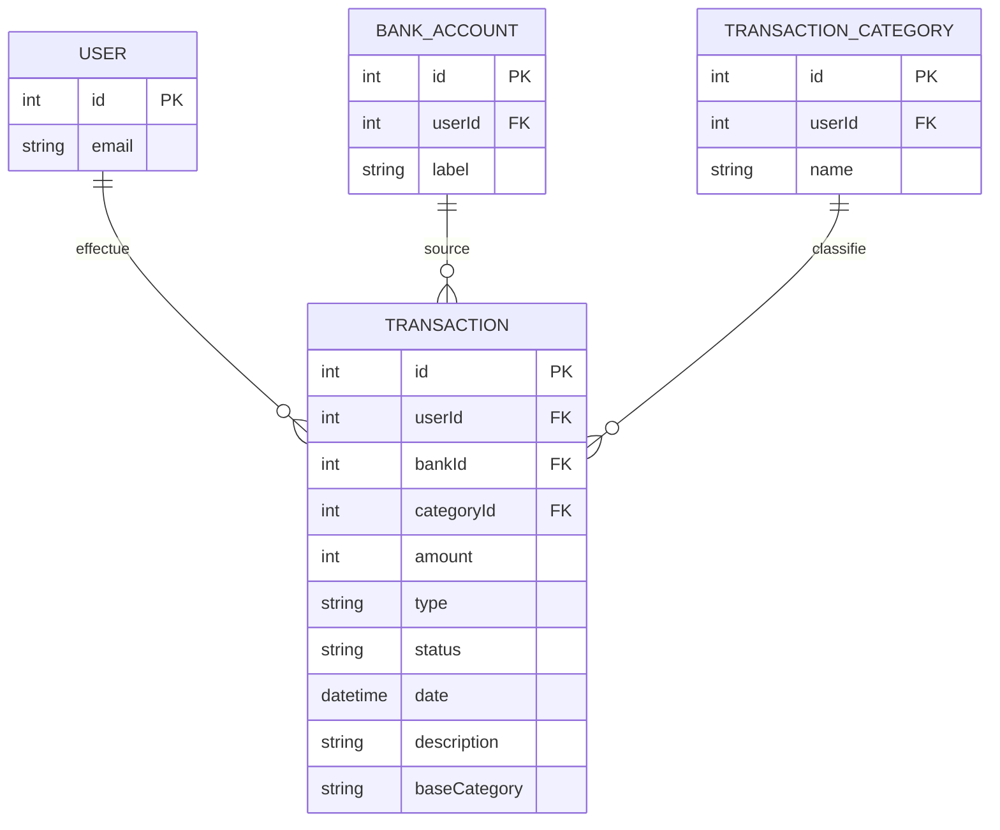

# Modèle de données - Transaction
## Vue d'ensemble
> Le modèle `Transaction` représente les mouvements financiers effectués par un utilisateur.
> Chaque transaction est rattachée à un compte bancaire (`BankAccount`) et à une catégorie (`TransactionCategory`) pour faciliter le suivi et l'analyse des finances.
> Le champ `baseCategory` permet une catégorisation automatique ou secondaire non modifiable par l'utilisateur.

## Schéma du modèle
### Diagramme

### Définition technique
```json
{
  "type": "object",
  "properties": {
    "id": { "type": "integer" },
    "userId": { "type": "integer" },
    "bankId": { "type": "integer" },
    "categoryId": { "type": "integer" },
    "amount": { "type": "number" },
    "type": { "type": "string", "enum": ["credit", "debit"] },
    "status": { "type": "string", "enum": ["pending", "completed", "failed"] },
    "date": { "type": "string", "format": "date-time" },
    "description": { "type": "string" },
    "baseCategory": { "type": "string" }
  },
  "required": ["userId", "amount", "type", "status", "date"]
}
```
## Contraintes de validation
| Champ       | Type     | Contraintes                                                |
| ----------- | -------- | ---------------------------------------------------------- |
| `userId`       | int      | Doit correspondre à un utilisateur existant                                |
| `bankId`       | int      | Optionnel - doit référencer un `BankAccount` appartenant à l'utilisateur   |
| `categoryId`   | int      | Optionnel - doit référencer une `TransactionCategory` de l'utilisateur     |
| `amount`       | number   | Strictement positif. Stocké en centimes en base (`int`)                    |
| `type`         | string   | `"credit"` ou `"debit"`                                                    |
| `status`       | string   | `"pending"`, `"completed"` ou `"failed"`                                   |
| `date`         | datetime | Format ISO 8601                                                            |
| `description`  | string   | Optionnel, max 255 caractères                                              |
| `baseCategory` | string   | Optionnel - utilisé pour l'auto-catégorisation (non modifiable par l'user) |

## Relations avec d'autres modèles
| Relation | Modèle lié          | Type de relation                                  | Clé étrangère |
| -------- | ------------------- | ------------------------------------------------- | ------------- |
| N-1      | User                | Chaque transaction appartient à un utilisateur    | `userId`      |
| N-1      | BankAccount         | Chaque transaction concerne un compte bancaire    | `bankId`      |
| N-1      | TransactionCategory | Chaque transaction est classée dans une catégorie | `categoryId`  |

## Index & performances
* Index sur `(userId, date)` : permet un tri rapide de l'historique utilisateur
* Index sur `bankId` : utilisé pour vérifier l'utilisation d'un compte avant suppression
* Index sur `categoryId` : utilisé pour l'analyse et la suppression sécurisée de catégories

## Logique métier importante
* **Impact sur le solde du compte (`BankAccount.balance`)** :
  * Création d'une transaction :
    * `credit` → augmente le solde
    * `debit` → diminue le solde
  * Mise à jour :
    * Si le montant change, ajustement du solde
    * Si le compte bancaire est modifié, réajustement des deux comptes concernés
  * Suppression :
    * Le montant est répercuté à l'inverse pour restaurer le solde initial
* **Montant en centimes** :
  * Le champ `amount` est manipulé côté application comme un `float` en euros
  * En base de données, il est stocké comme un entier (centimes) pour éviter les erreurs de précision
* **Pagination** :
  * Tous les endpoints listant des transactions supportent `limit` et `offset` (par défaut : 50)
* **Sécurité & permissions** :
  * Tous les accès à la ressource `Transaction` sont protégés par une authentification et des permissions spécifiques
  * Vérification explicite de la propriété des ressources (`userId`, `bankId`, `categoryId`)

## Notes & références
* Voir les détails des règles métiers dans [`transaction.core.ts`](../services/transaction.core.ts)
* Spécifications des endpoints : [endpoints.md](./endpoints.md)
* Lien vers [specification.md](./specification.md)
* Lien vers [endpoints.md](./endpoints.md)
* Voir aussi la documentation :
  * [Settings](../settings/data-model.md)
  * [Rôles & permissions](../auth/roles.md)