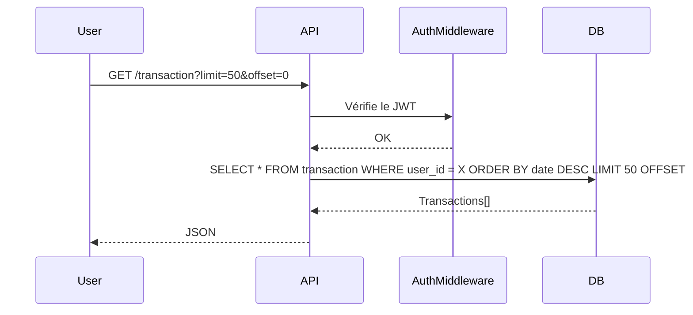
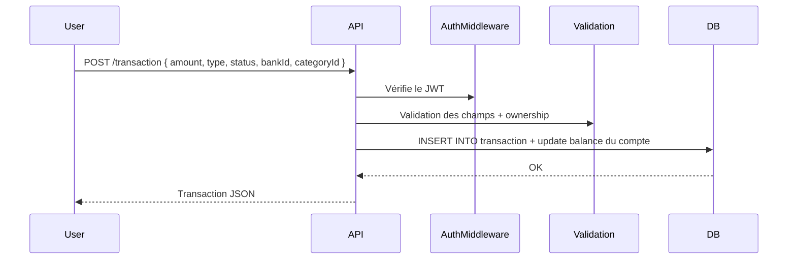
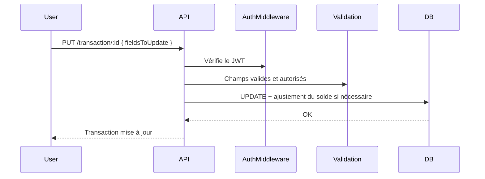
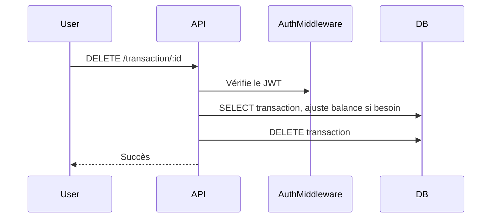

# Transactions
## Contexte
Les utilisateurs doivent pouvoir **gérer leurs transactions financières** (revenus et dépenses) liées à leurs comptes bancaires et catégories.
Cette fonctionnalité centralise, historise et permet de manipuler les mouvements financiers dans l'application.
## Objectifs
Permettre à l'utilisateur connecté de :
* Lister ses transactions avec pagination (`limit`, `offset`).
* Consulter une transaction spécifique.
* Créer une transaction (crédit ou débit).
* Mettre à jour une transaction existante.
* Supprimer une transaction.
* Affecter une catégorie personnalisée (`categoryId`) ou générique (`baseCategory`).
* Suivre les soldes des comptes bancaires associés.

## Portée (Scope)
### Inclus
* CRUD des transactions.
* Affectation à un compte bancaire (`bankId`) et une catégorie (`categoryId` ou `baseCategory`).
* Vérification des droits via `PermissionsManager`.
* Mise à jour du solde du compte lors de la création, la modification ou la suppression d'une transaction.
* Validation des champs (type, status, montants).
* Séparation logique entre champs obligatoires et optionnels (`description`, `baseCategory`...).
* Pagination (`limit` par défaut à 50, maximum à 150).

### Exclus
* Import/export de transactions (CSV, API tierces).
* Mécanismes automatiques de synchronisation bancaire.

## Flux fonctionnels
### Lecture (liste)

### Création

### Mise à jour

### Suppression

## Dépendances
* **Services internes** :
  * `auth` & `roles` (isAuth, checkPermission).
  * `handleCoreResponse` / `catchSync` (gestion d'erreurs et de la réponse standardisée).
  * `validation` (validation des entrées & ownership des ressources).
* **Librairies tierces** :
  * `express` pour le routage.
  * `ts-sql-query` pour les requêtes SQL type-safe.
* **APIs externes** : Aucune.

## Contraintes techniques
### Performance
* Pagination : `limit` (max. 150), `offset`.
* Index sur `(user_id, date)`.
* Amount stocké en **centimes entiers** (`amount * 100` en base) pour éviter les imprécisions.
### Sécurité
* Toutes les opérations nécessitent un utilisateur authentifié (`isAuth`).
* Vérification systématique via `PermissionsManager`.
* Contrôle de propriété : l'utilisateur ne peut agir que sur ses ressources (`bankId`, `categoryId`).
### Compatibilité
* Node.js ≥ 18, Express ≥ 4.
* Base de données relationnelle avec requêtes via `ts-sql-query`.

## Règles métier
| Champ          | Règle                                                                             |
| -------------- | --------------------------------------------------------------------------------- |
| `type`         | Obligatoire. Valeurs autorisées : `credit`, `debit`.                              |
| `status`       | Facultatif. Valeurs : `pending`, `completed`, `failed`. Par défaut : `completed`. |
| `amount`       | Obligatoire. Supérieur à 0. Stocké en centimes.                                   |
| `bankId`       | Facultatif. Doit appartenir à l'utilisateur.                                      |
| `categoryId`   | Facultatif. Doit appartenir à l'utilisateur.                                      |
| `baseCategory` | Facultatif. Utilisée en l'absence de `categoryId`.                                |
| `description`  | Optionnelle. Texte libre.                                                         |
| `date`         | Facultative. Par défaut : `new Date()`.                                           |
| Suppression    | Définitive. Aucune corbeille, pas de restauration possible.                       |
| Solde compte   | Automatiquement ajusté lors de la création, mise à jour ou suppression.           |

## Cas limites et erreurs prévues
| Cas                                 | Comportement attendu        |
| ----------------------------------- | --------------------------- |
| `transactionId` inexistant                           | `404 Transaction introuvable`                   |
| Transaction d'un autre utilisateur                   | `403 Forbidden`                                 |
| `amount` ≤ 0 ou invalide                             | `400 Bad Request`                               |
| `type` invalide                                      | `400 Bad Request`                               |
| Références à une catégorie ou un compte non possédés | `403 Forbidden`                                 |
| Aucune donnée à mettre à jour (`PUT`)                | `400 Bad Request` (via `ensureAtLeastOneField`) |
| Transaction déjà supprimée                           | `404 Transaction introuvable`                   |

## Données techniques supplémentaires
* Champ `amount` converti à la volée (`/100`) lors des lectures pour retour en euros.
* Mise à jour conditionnelle du solde :
  * Changement de montant → ajustement du solde.
  * Changement de compte bancaire → ajustement des 2 comptes (ancien et nouveau).
* Méthodes d'accès aux données dans `Transaction` :
  * `findAllByUserId({ userId, limit, offset })`
  * `findById({ id, userId })`
  * `insert({...})`
  * `updateById({ id, userId, data })`
  * `deleteById({ id, userId })`
  * `existsByAccountId({ id, userId })`
  * `existsByCategoryId({ id, userId })`

## Références
* [`endpoints.md`](./endpoints.md) - spécifications des routes REST (`/transaction`).
* [`data-model.md`](./data-model.md) - schéma SQL de la table `transaction`.
* Modules internes :
  * `auth`, `roles`, `PermissionsManager`.
  * `handleCoreResponse`, `catchSync`, `validation`.