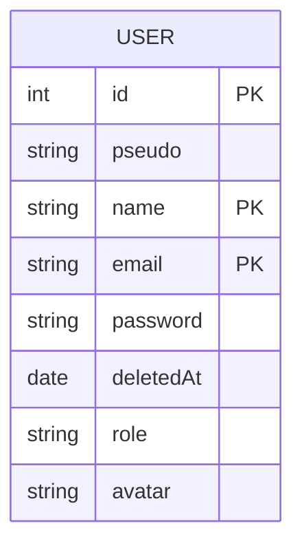

# Modèle de données - `User`
## Vue d'ensemble
> Le modèle `User` centralise l'authentification, l'autorisation et la gestion du profil utilisateur. Il prend également en charge :
>
> * La génération et la validation de tokens HMAC signés.
> * La suppression logique (`soft delete`) du compte.
> * La gestion des mises à jour sécurisées de l'email et du mot de passe.

## Schéma du modèle
### Diagramme


### Définition technique
```json
{
  "type": "object",
  "properties": {
    "id": { "type": "integer" },
    "pseudo":    { "type": "string", "maxLength": 16 },
    "name":      { "type": "string", "maxLength": 16 },
    "email": { "type": "string", "format": "email" },
    "password": { "type": "string" },
    "role": { "type": "string", "enum": ["USER", "STAFF_MODERATOR", "ADMIN"] },
    "avatar": { "type": "string", "format": "uri" },
    "deletedAt": { "type": ["string", "null"], "format": "date-time" }
  },
  "required": ["id", "name", "pseudo", "email", "password", "role"]
}
```

## Contraintes de validation
| Champ    | Type   | Contraintes                                                 |
| -------- | ------ | ----------------------------------------------------------- |
| `id`        | int    | Clé primaire auto-incrémentée                                   |
| `pseudo`    | string | Obligatoire, max 16 caractères, indexé                          |
| `name`      | string | Obligatoire, unique, max 16 caractères                          |
| `email`     | string | Obligatoire, unique, format RFC valide                          |
| `password`  | string | Stocké sous forme hachée (`bcrypt.hashSync(password, 10)`)      |
| `role`      | string | Valeur dans `["USER", "STAFF_MODERATOR", "ADMIN"]`              |
| `avatar`    | string | URL valide, facultatif                                          |
| `deletedAt` | date   | Définit si l'utilisateur est supprimé logiquement (soft delete) |

## Relations avec d'autres modèles
| Relation | Modèle lié | Type           | Détails                                        |
| -------- | ---------- | -------------- | ---------------------------------------------- |
| 1-N      | Token/API  | Non persistant | Token généré dynamiquement, non stocké en base |
> 💡 **Note** : Les tokens sont générés dynamiquement (HMAC SHA-256 + Base64URL) à partir de `id`, `email`, `role` et d'un timestamp.

## Index & performances
* 🔑 **Index unique** sur : `email`, `pseudo`, `name`
* ⚡ **Index implicite** sur : `id` (clé primaire)
* 🗃️ Aucun index secondaire : l'accès se fait généralement via `email` ou `id`

## Gestion des tokens (`User.generateToken` / `User.decodeToken`)
* Encodage :
  * `{ id, email, role }` + timestamp → base64url
* Signature HMAC :
  * Clé secrète : `process.env.SIGNEDTOKENSECRET`
* Durée de validité : `process.env.VALIDTIMETOKEN` (par défaut : 1h)
* Décodage → vérifie la signature et la validité temporelle

## Sécurité & bonnes pratiques
| Risque                             | Contremesure                                                        |
| ---------------------------------- | ------------------------------------------------------------------- |
| Token falsifié                     | Signature HMAC + timestamp + secret en variable d'environnement     |
| Mot de passe compromis             | Comparaison bcrypt avec salage (`compare` de bcryptjs)              |
| Injection dans `pseudo` / `name`   | Nettoyage et validation stricte côté serveur                        |
| Modification non autorisée         | Utilisation systématique de `req.user.id` issu du token             |
| Champs sensibles dans les réponses | `password`, `authKey`, `deletedAt` exclus de tout `selectBase`      |
| Suppression accidentelle           | Soft delete (`deletedAt`) et restauration possible (`RecoveryById`) |

## Services liés
| Fonction                      | Description                                    |
| ----------------------------- | ---------------------------------------------- |
| `User.insert`                 | Crée un utilisateur + retourne son token       |
| `User.login`                  | Authentifie par email, retourne le token       |
| `User.findById / findByEmail` | Récupération sécurisée des infos utilisateur   |
| `User.updateById`             | Mise à jour sécurisée du profil utilisateur    |
| `User.UpdatePass`             | Mise à jour du mot de passe après vérification |
| `User.softDeleteById`         | Supprime logiquement un utilisateur            |
| `User.RecoveryById`           | Restaure un utilisateur supprimé               |

## Contrôles d'accès (`middleware`)
* **`isAuth`** : Vérifie le token et injecte `req.user`
* **`checkPermission(Permissions.UserXXXOwn)`** : ACL par action (`view`, `update`, `delete`)
* **Token expiré/invalide** → rejet immédiat avec erreur 401/403

## Notes complémentaires
* 📦 Librairies :
  * `bcryptjs` - hachage sécurisé des mots de passe
  * `crypto` (Node.js) - signature HMAC des tokens
  * `ts-sql-query` - ORM typé pour accès BDD
* 🧱 Structure `Controller → Service → Model` respectée dans toutes les actions
* ✅ Suppression logique (`deletedAt`) au lieu de suppression physique
* 🔁 En cas de tentative de login avec un compte supprimé → token toujours généré, mais flag `deleted: true` renvoyé

## 📚 Références internes
* [controllers/user.controller.ts](../controllers/user.controller.ts)
* [services/user.core.ts](../services/user.core.ts)
* [models/user.models.ts](../models/user.models.ts)
* [specification.md](./specification.md)
* [endpoints.md](./endpoints.md)
* [data-model.md](./data-model.md)