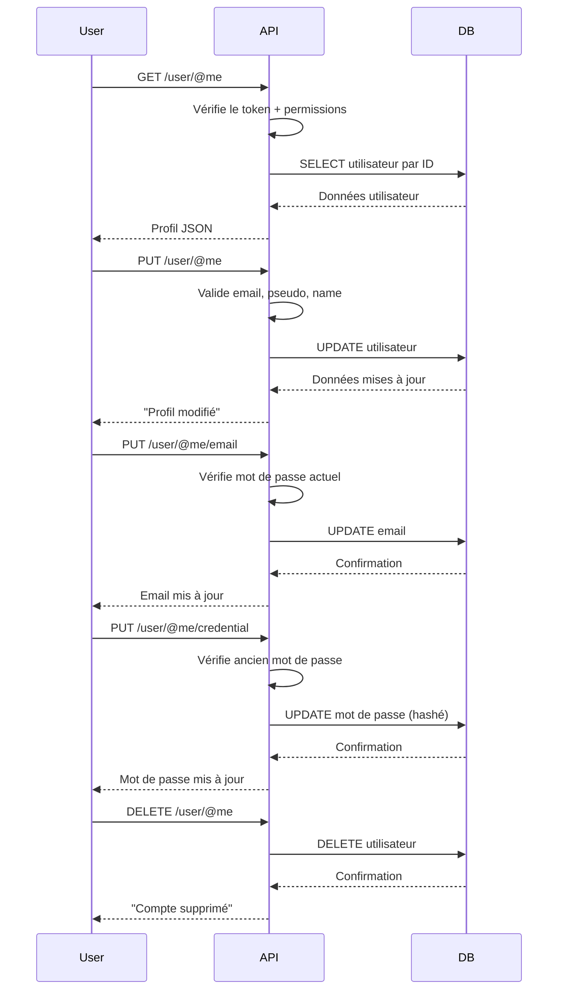

# Gestion du profil utilisateur (`/user/@me`)
## Contexte
> Les utilisateurs doivent pouvoir consulter, mettre à jour et supprimer leurs informations personnelles de manière sécurisée depuis leur espace personnel.

## Objectifs
* Permettre à un utilisateur authentifié de :
  * consulter ses données de profil,
  * mettre à jour son nom, pseudo ou email,
  * changer son mot de passe,
  * supprimer son compte.

## Portée (Scope)
### Inclus
* **`GET /user/@me`** : récupération du profil connecté.
* **`PUT /user/@me`** : mise à jour du `name` et `pseudo`.
* **`PUT /user/@me/email`** : changement de l'email (avec mot de passe actuel).
* **`PUT /user/@me/credential`** : changement du mot de passe.
* **`DELETE /user/@me`** : suppression (logique) du compte.
* Authentification obligatoire via token signé.
* Contrôle d'accès via permissions :
  * `UserViewOwn`, `UserUpdateOwn`, `UserDeleteOwn`.

### Exclus
* Création de compte et connexion (voir `auth`).
* Réinitialisation du mot de passe via email.
* Gestion des avatars (upload, stockage).
* Rafraîchissement et révocation de token.

## Endpoints
| Méthode | URL                    | Description                          | Permissions requises |
| ------- | ---------------------- | ------------------------------------ | -------------------- |
| GET     | `/user/@me`            | Récupérer les infos du profil        | `UserViewOwn`        |
| PUT     | `/user/@me`            | Modifier le nom ou pseudo            | `UserUpdateOwn`      |
| PUT     | `/user/@me/email`      | Modifier l'email (avec mot de passe) | `UserUpdateOwn`      |
| PUT     | `/user/@me/credential` | Modifier le mot de passe             | `UserUpdateOwn`      |
| DELETE  | `/user/@me`            | Supprimer le compte (soft delete)    | `UserDeleteOwn`      |

## Flux fonctionnel

## Contraintes techniques
### Sécurité
* Authentification via token HMAC-SHA256 signé (généré avec `SIGNEDTOKENSECRET`).
* Vérification systématique des permissions (middleware `checkPermission`).
* Toutes les requêtes utilisent l'ID du token (`req.user.id`) → jamais d'ID transmis en payload.
* Aucun champ sensible (`password`, `authKey`) n'est retourné côté client.
### Validation
* `name` et `pseudo` :
  * max. 15 caractères,
  * contrôlés côté serveur.
* `email` :
  * validé avec `email-validator`,
  * doit être unique en base.
* Modification d'email nécessite le mot de passe actuel.
* Modification de mot de passe nécessite l'ancien mot de passe.
### Performance
* Sélection des champs strictement nécessaires (`id`, `name`, `email`, `pseudo`, `role`, `avatar`).
* Soft delete avec champ `deletedAt`.
* Réponses < 150ms en moyenne attendues.

## Cas limites et erreurs prévues
| Cas                                                      | Réponse attendue   |
| -------------------------------------------------------- | ------------------ |
| Non authentifié                                          | `401 Unauthorized` |
| Permission insuffisante                                  | `403 Forbidden`    |
| Utilisateur inexistant ou supprimé                       | `404 Not Found`    |
| Email déjà utilisé                                       | `400 Bad Request`  |
| Email invalide                                           | `400 Bad Request`  |
| Nom ou pseudo trop long                                  | `400 Bad Request`  |
| Mot de passe actuel invalide (PUT /email ou /credential) | `400 Bad Request`  |

## Services utilisés
* `getUserProfile(id)` → `User.findById`
* `updateUserProfile({ id, data })` → `User.updateById`
* `updateUserEmail({ id, { email, password }})` → vérifie le mot de passe, puis `User.updateById`
* `updateUserPassword({ id, { oldPassword, newPassword }})` → compare, hash, puis `User.UpdatePass`
* `deleteUserAccount(id)` → `User.softDeleteById`

## Règles métier
* L'utilisateur ne peut agir **que sur son propre compte** (`req.user.id` injecté par le middleware `isAuth`).
* Toutes les modifications critiques doivent être confirmées par mot de passe (email, mot de passe).
* Le compte supprimé peut être réactivé (via `RecoveryById` côté admin, non exposé ici).

## Sécurité & Bonnes pratiques
| Risque                    | Solution                                        |
| ------------------------- | ----------------------------------------------- |
| Token manipulé ou expiré  | Validation HMAC + contrôle de date d'expiration |
| Modification par un tiers | Utilisation stricte de `req.user.id`            |
| XSS / injection           | Validation et nettoyage des champs texte        |
| Email déjà utilisé        | Validation unicité via BDD                      |
| Compte déjà supprimé      | Soft delete contrôlé sur `deletedAt`            |

## Références
* [endpoints.md](./endpoints.md)
* [data-model.md](./data-model.md)
* [specification.md](./specification.md)
* [OWASP - Input Validation Cheat Sheet](https://cheatsheetseries.owasp.org/cheatsheets/Input_Validation_Cheat_Sheet.html)